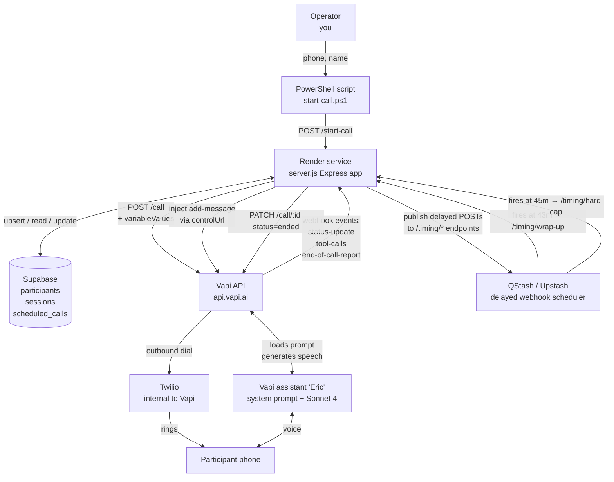
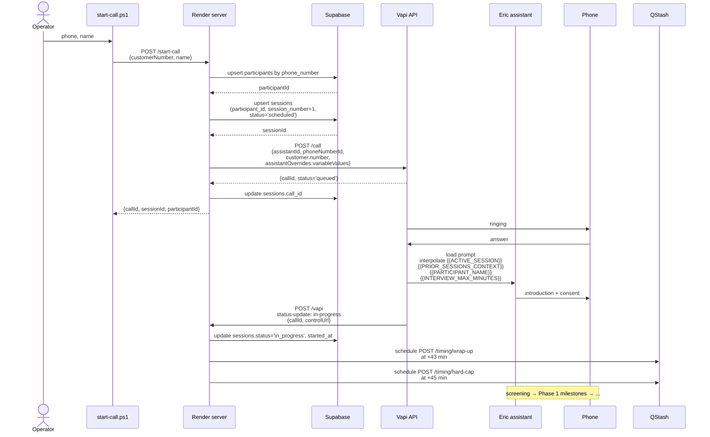
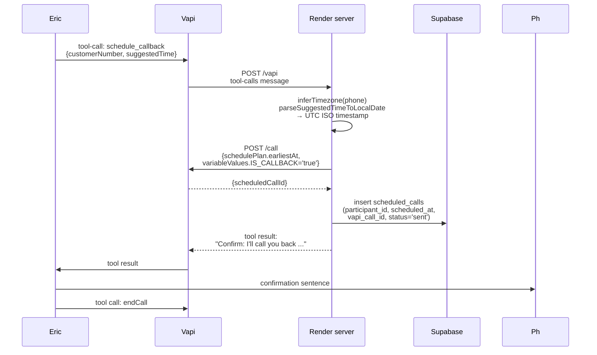
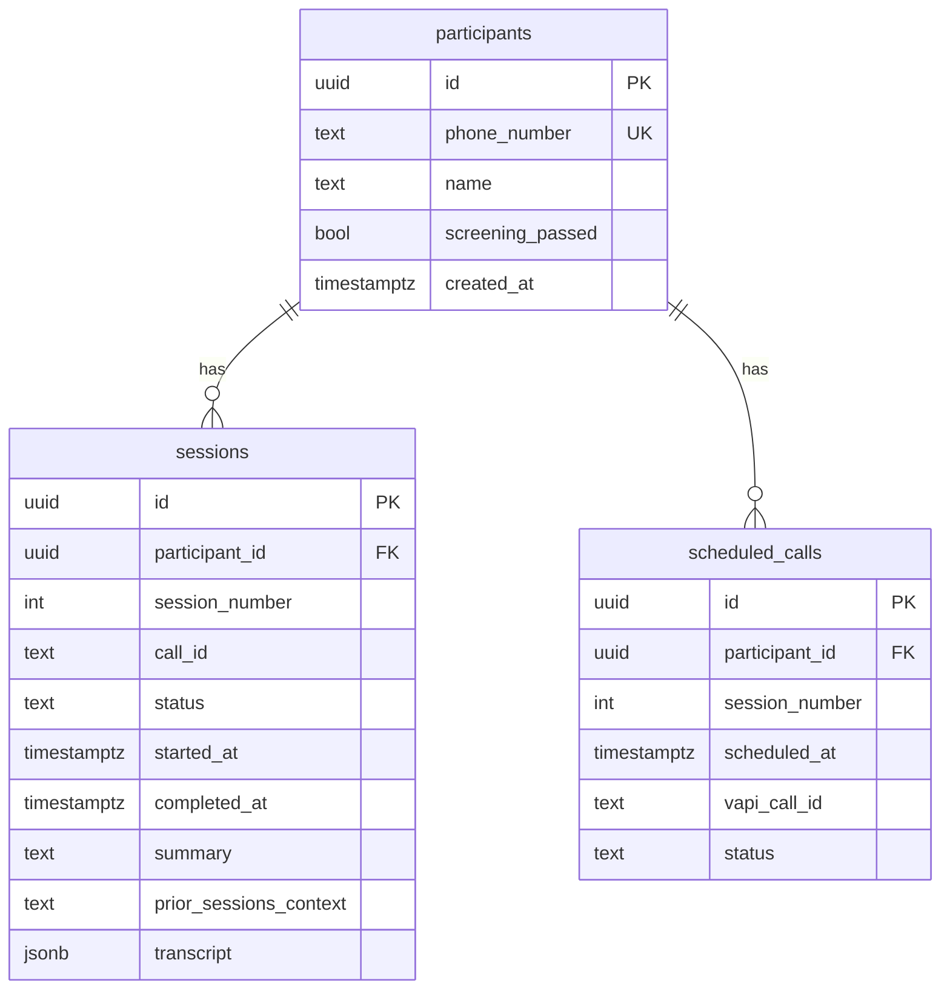

# Architecture — Phase 1

How the Eric voicebot stack fits together. Renders inline in VS Code's
markdown preview (open this file → click the preview icon top-right).

## Components



## Sequence 1 — starting a call



## Sequence 2 — wrap-up signal and close

```mermaid
sequenceDiagram
    participant Q as QStash
    participant SVR as Render server
    participant V as Vapi controlUrl
    participant A as Eric
    participant Ph as Phone
    participant SB as Supabase

    Note over Q: t = 43 min
    Q->>SVR: POST /timing/wrap-up<br/>{callId, controlUrl, content}
    SVR->>V: POST controlUrl<br/>{type: 'add-message',<br/>message: 'Wrap-up signal: ...'}
    A->>Ph: open-ended close question
    Ph->>A: final response
    A->>Ph: closing line
    A->>V: tool call: endCall
    V->>SVR: POST /vapi<br/>end-of-call-report<br/>{transcript, messages}
    SVR->>SB: update sessions<br/>status='completed', completed_at,<br/>transcript

    Note over Q: t = 45 min (fail-safe; only fires if call still live)
    Q->>SVR: POST /timing/hard-cap {callId}
    SVR->>V: PATCH /call/:id {status: 'ended'}
```

## Sequence 3 — callback scheduling

Triggered when the participant says "call me back at X" during the call.



## Runtime variables — what flows where

The server passes these into Vapi at call start via `assistantOverrides.variableValues`. Vapi makes them available to the assistant's system prompt by name, and substitutes `{{NAME}}` tokens inline.

| Variable | Source | Consumed by |
| --- | --- | --- |
| `ACTIVE_SESSION` | hard-coded `"1"` for MVP | prompt: `<active_session>{{ACTIVE_SESSION}}</active_session>` |
| `PRIOR_SESSIONS_CONTEXT` | server param (empty for Session 1) | prompt: `<prior_sessions_context>` block |
| `PARTICIPANT_NAME` | participants table or empty | prompt: openings, warm bridges |
| `INTERVIEW_MAX_MINUTES` | Render env (default 45) | prompt: `<time_management>`, intro |
| `IS_CALLBACK` | server (`"false"` for fresh, `"true"` for callbacks) | prompt: opening branch |
| `SCREENING_QUESTIONS_JSON` | Render env | prompt: `<screening_logic>` |

## Server-only env vars (never reach the model)

| Variable | Used by |
| --- | --- |
| `VAPI_API_KEY` | server.js → Vapi REST calls |
| `ASSISTANT_ID` | server.js → which Vapi assistant to dial with |
| `PHONE_NUMBER_ID` | server.js → which Vapi phone number to dial from |
| `QSTASH_TOKEN` | server.js → schedule delayed webhooks |
| `RENDER_BASE_URL` | server.js → callback URLs registered with QStash |
| `WRAPUP_OFFSET_MINUTES` | server.js → minutes before hard cap to fire wrap-up |
| `SUPABASE_URL` | server.js → Supabase REST |
| `SUPABASE_SERVICE_ROLE_KEY` | server.js → Supabase auth (bypasses RLS) |

## Data model



`sessions` has `UNIQUE(participant_id, session_number)`. `createSessionRow` upserts on that key, so re-calling the same phone resets the row to a fresh `scheduled` state.
